# Mermaid 语法参考

生成有效 Mermaid 图表代码的快速参考。

## 流程图

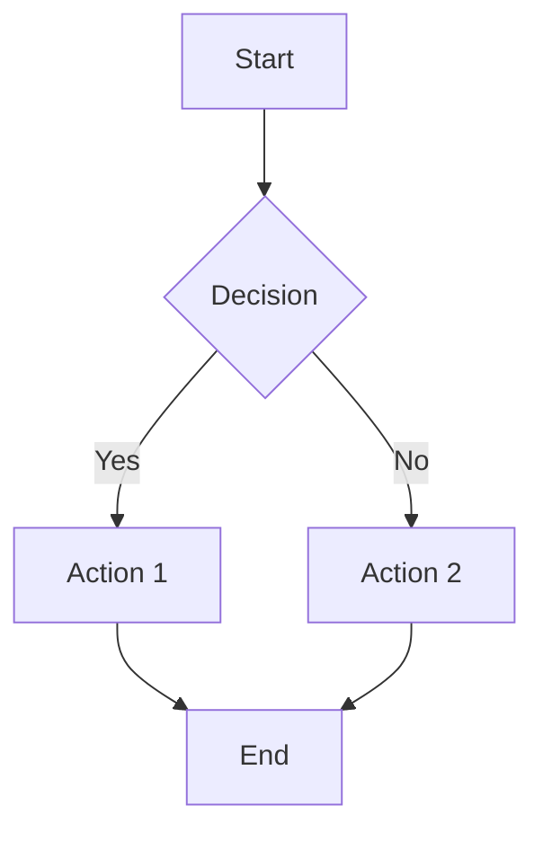

### 方向
- `TD` / `TB` - 从上到下
- `BT` - 从下到上
- `LR` - 从左到右
- `RL` - 从右到左

### 节点形状
- `A[Text]` - 矩形
- `A(Text)` - 圆角矩形
- `A([Text])` - 体育场/药丸形
- `A[[Text]]` - 子程序
- `A[(Text)]` - 圆柱体（数据库）
- `A((Text))` - 圆形
- `A>Text]` - 非对称
- `A{Text}` - 菱形（决策）
- `A{{Text}}` - 六边形
- `A[/Text/]` - 平行四边形
- `A[\Text\]` - 平行四边形替代
- `A[/Text\]` - 梯形
- `A[\Text/]` - 梯形替代

### 边样式
- `A --> B` - 箭头
- `A --- B` - 直线
- `A -.-> B` - 虚线箭头
- `A ==> B` - 粗箭头
- `A -->|text| B` - 带标签的箭头（推荐）
- `A ---|text| B` - 带标签的直线（推荐）

**重要**：始终使用管道语法 `-->|label|` 表示边标签。空格-破折号语法 `-- label -->` 可能导致渲染不完整。

### 子图
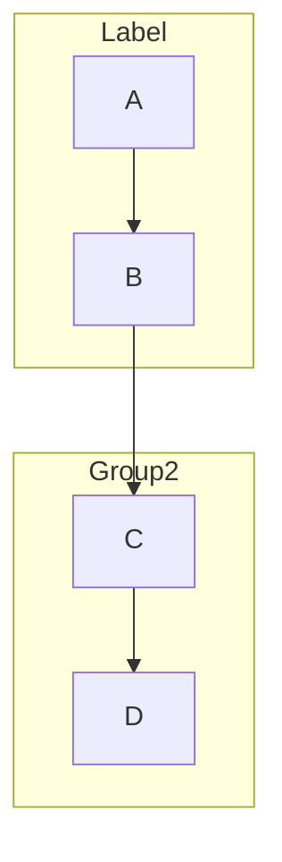

## 时序图

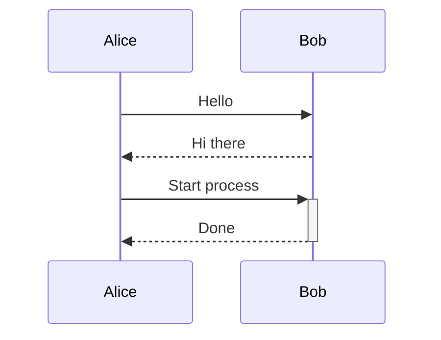

### 箭头类型
- `->>` - 实线箭头
- `-->>` - 虚线箭头
- `-x` - 实线带叉
- `--x` - 虚线带叉
- `-)` - 实线开口箭头
- `--)` - 虚线开口箭头

### 激活
- `+` 在箭头后激活参与者
- `-` 在箭头后取消激活参与者

### 注释和框
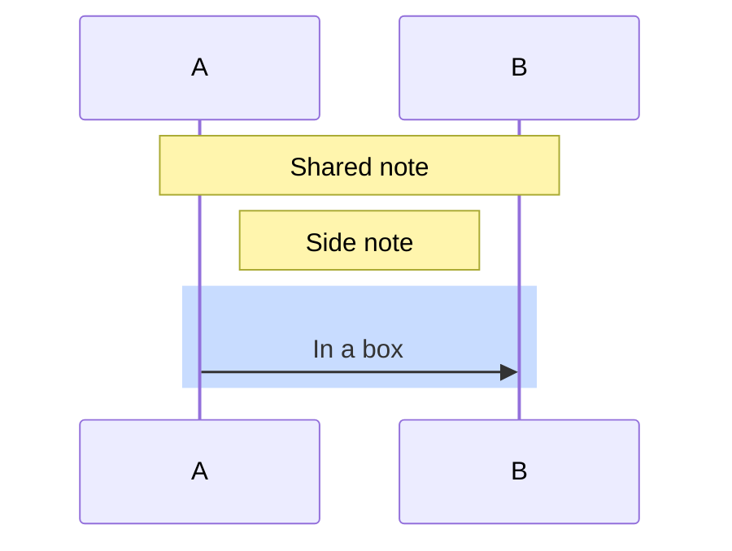

### 循环和条件
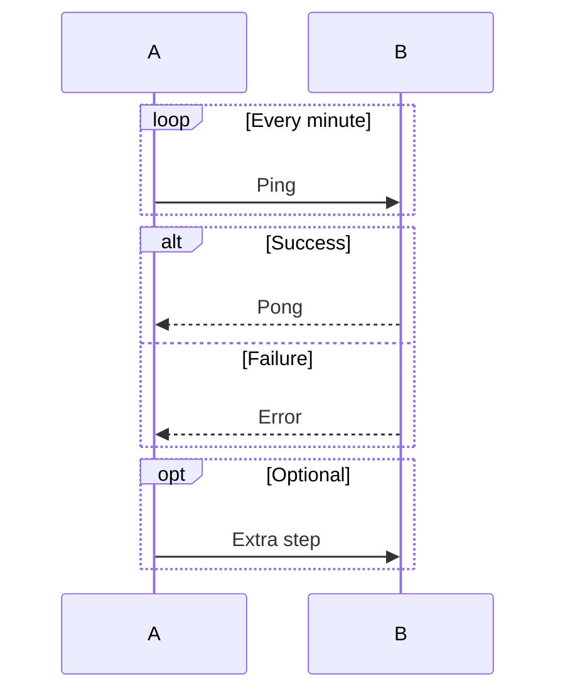

## 状态图

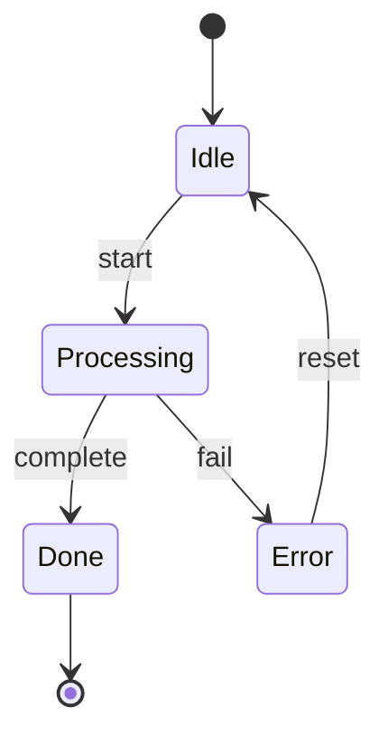

### 复合状态
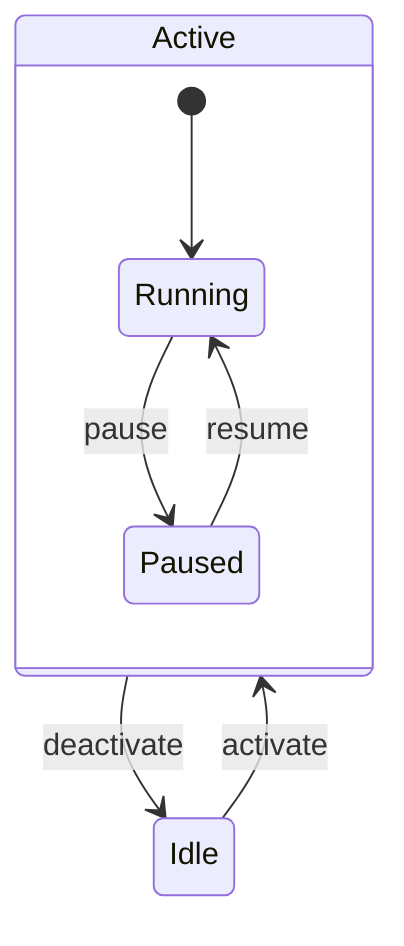

### 注释
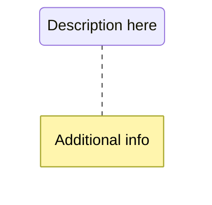

## 类图

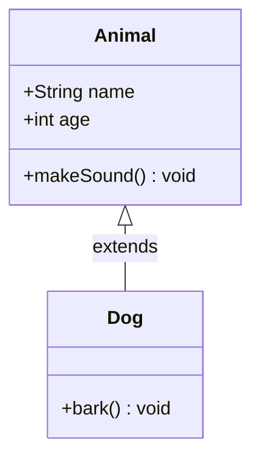

### 关系
- `<|--` - 继承
- `*--` - 组合
- `o--` - 聚合
- `-->` - 关联
- `--` - 链接（实线）
- `..>` - 依赖
- `..|>` - 实现
- `..` - 链接（虚线）

### 基数
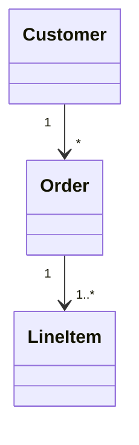

### 可见性
- `+` 公开
- `-` 私有
- `#` 受保护
- `~` 包/内部

## 实体关系图

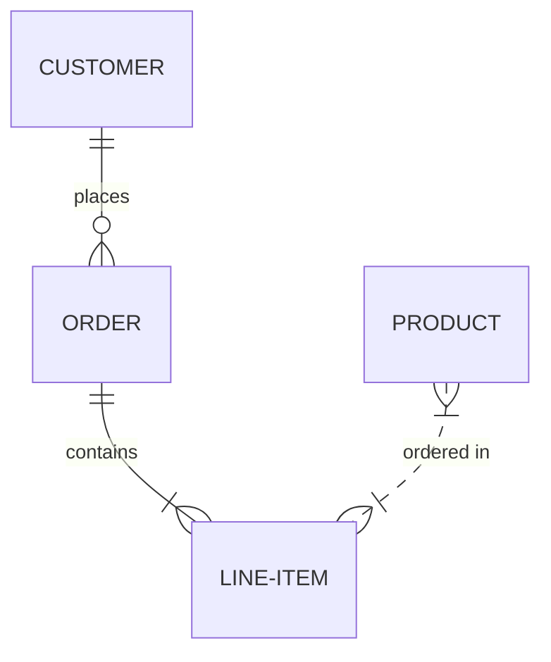

### 关系类型
- `||` - 恰好一个
- `|{` - 一个或多个
- `o{` - 零个或多个
- `o|` - 零个或一个

### 标识与非标识
- `--` - 标识（实线）
- `..` - 非标识（虚线）

### 属性
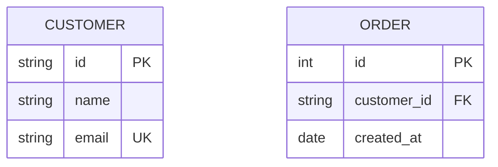

## 样式

### CSS 类
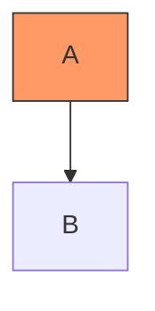

### 内联样式
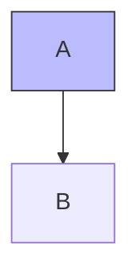

## 提示

1. **转义特殊字符**：对包含特殊字符的标签使用引号：`A["Label with (parens)"]`
2. **多行标签**：使用 ` ` 换行
3. **注释**：使用 `%%` 表示不会渲染的注释
4. **ID 与标签**：节点 ID 应简单，标签可以复杂：`node1["Complex Label Here"]`
