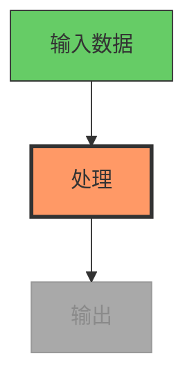

# OpenMontage 图表生成使用指南

> 来源：Mermaid.js 文档、现有 Layer 3 技能位于 `.agents/skills/beautiful-mermaid/`、
> Mermaid-Sonar 复杂度分析研究、Mermaid GitHub issues #651（缩放）、#3029（动画）

## 快速参考卡

```
最大节点数（1080p）：  15-20节点，20-25边
最大节点数（4K）：     25-35节点，35-45边
最大节点数（竖屏）：   10-12节点，12-15边
最小字体大小：         1080p下16px，4K下14px
渲染宽度：             最小1200px
渲染视口：             3840x2160（4K）用于高分辨率 PNG 导出
主题（深色背景）：     tokyo-night 或 dracula
主题（浅色背景）：     github-light 或 catppuccin-latte
```

## 图表类型选择

| 类型 | 视频适宜性 | 最适合 |
|------|-----------|--------|
| **流程图（TD）** | 优秀 | 流程、决策树、算法 |
| **时序图** | 好 | API 调用、用户交互、消息流 |
| **状态图** | 好 | 状态机、生命周期、工作流状态 |
| **类图** | 一般 | 架构（限制在3-5类） |
| **ER 图** | 差（视频） | 过于密集 — 简化到仅关键实体 |
| **甘特图** | 一般 | 时间线、项目阶段 |
| **思维导图** | 好 | 概念概览、主题分解 |

**默认：** 除非内容特别需要其他类型，使用流程图（自上而下 `TD`）。它们阅读自然，且适合逐步构建。

## 视频的复杂度限制

视频是瞬态的 — 观众不能缩放或滚动。与静态文档相比将复杂度减半。

| 目标分辨率 | 最大节点 | 最大边 | 最小字体大小（CSS） |
|-----------|---------|-------|---------------------|
| 1920x1080（HD） | 15-20 | 20-25 | 16px |
| 3840x2160（4K） | 25-35 | 35-45 | 14px |
| 1080x1920（竖屏） | 10-12 | 12-15 | 18px |

**如果图表超出这些限制：** 拆分为多个帧，每帧显示一个子集。这也为视频创建了自然的"构建"动画。

## 视频的色彩主题

| 使用场景 | 主题 | 原因 |
|----------|------|------|
| 深色视频背景 | `tokyo-night` 或 `dracula` | 高对比度、可读 |
| 浅色视频背景 | `github-light` 或 `catppuccin-latte` | 柔和、专业 |
| 代码/开发者内容 | `one-dark` | 开发者观众熟悉 |
| 最大对比度 | `zinc-dark` | 中性，无颜色偏差 |
| 企业/演示 | `nord-light` | 冷静、专业 |

**匹配剧本：** 图表主题应补充风格剧本的调色板。

## 视频的渐进构建

Mermaid 不自带动画。使用渐进式渲染创建"构建"效果：

### 方法：多阶段渲染

1. 分阶段渲染图表 — 前2个节点，然后4个，然后完整图表
2. 每个阶段是一个独立的 Mermaid 渲染 → SVG → PNG
3. 在 FFmpeg 中在阶段之间交叉淡入淡出或剪切
4. 观众逐步跟随逻辑

### 高亮当前步骤

使用 `classDef` 高亮活动节点并淡化已完成的节点：



每步生成一个带有不同 `classDef` 分配的 PNG，然后在合成阶段排序。

## 视频可读性样式

### 节点大小
- 最小节点宽度：1080p下150px
- 节点内边距：15-20px
- 每个节点保持3-5个词 — 必要时使用缩写

### 边标签
- 最多1-2个词
- 仅当关系从上下文中不明显时才使用边标签
- 优先使用带标签的节点而非带标签的边

### 布局方向
- **自上而下（TD）：** 最适合流程、层级、流程
- **从左到右（LR）：** 最适合时间线、序列、管道
- 避免自下而上（BT）— 对大多数观众反直觉

## 应用于 OpenMontage

使用 `diagram_gen` 工具时：

1. **检查复杂度** — 1080p最多15-20节点。将更大的图表拆分为多个帧
2. **选择主题**以匹配视频的风格剧本和背景
3. **使用渐进构建** — 渲染阶段并交叉淡入淡出以在视频中实现"构建"效果
4. **使用 classDef 高亮** — 当前步骤显示为橙色/红色，已完成为绿色，即将进行的为灰色
5. **保持文字最少** — 每节点3-5个词，每边标签1-2个词
6. **默认使用流程图 TD**，除非内容特别需要其他图表类型
7. **以4K视口渲染**（3840x2160）即使输出1080p — 确保缩放时文字清晰
8. **测试可读性** — 在合成前以实际视频帧大小查看渲染的 PNG
